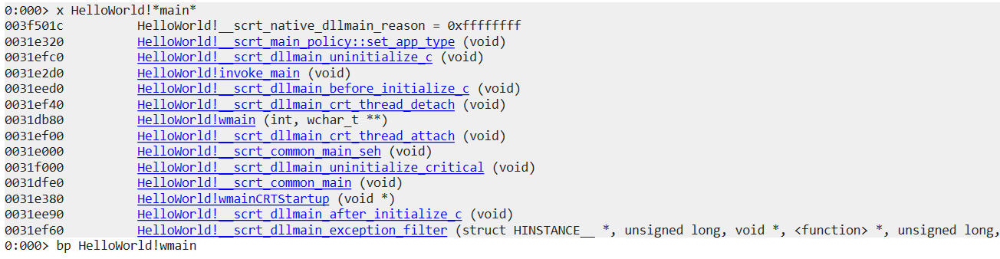

# Debugger Commands

**Table of Content**

* [**Help command**](#help-command)
* [**!analyze -v command**](#!analyze-v-command)
* [**Sympath command**](#sympath-command)
* [**Setting symbol path**](#setting-symbol-path)
* [**Debugger extensions**](#debugger-extensions)
* [**x command**](#x-command)
* [**ln command**](#ln-command)
* [**r command**](#r-command)
* [**k command**](#k-command)
* [**e command**](#e-command)
* [**u command**](#u-command)
* [**dc command**](#dc-command)
* [**dt command**](#dt-command)
* [**dv command**](#dv-command)
* [**'s' command**](#'s'-command)
* [**bp command**](#bp-command)
* [**t command**](#t-command)
* [**p command**](#p-command)
* [**gu command**](#gu-command)
* [**wt command**](#wt-command)
* [**.logopen command**](#t,p,.logopen-command)
* [**ChildEBP,retAddr,argstochild**](#childebp,retaddr,argstochild)
* [**Address Range**](#address-range)
* [**pipe command**](#pipe-command)
* [**version,vertarget commands**](#version,vertarget-commands)

## **Help command**

The Help command has the information about other commands.

we can launch help content in two ways.

**1. By clicking on help button.**

* Launch windbg application and select Local help button ,opens the Debugging Tools for Windows documentation.


* If you specify Text, the debugger opens the Index panel in the documentation and searches for Text as a keyword in the index.


**2. By .hh command**

* To use `.hh` command , Attach an notepad process to the debug(to attach notepad launch the notepad first).

* Click on File -> Attach to process -> notepad.exe -> attach 


* use `.hh` command to open the Debugging Tools for Windows documentation.

```markdown
.hh
```


* If you specify Text, the debugger opens the Index panel in the documentation and searches for Text as a keyword in the index.


**Example:**

```text
 Attach Process: 
        load notepad example

    > .hh
        Debugging Tools for Windows documentation

    > qd
        detach the process

```

## **!analyze -v command**

[click here for reference program](https://github.com/PadmanabhanSaravanan/windbg_Intro/tree/master/HelloWorld)

The `!analyze -v` command in WinDbg is a powerful automated debugging command that performs an analysis of the current state of the program being debugged, typically after an exception or crash.

```markdown
!analyze -v
```

Here's a breakdown of the command:

* **!analyze**: This is the basic automated analysis command. It performs an initial analysis of the state of the program.
* **-v**: This is an option that stands for "verbose". When you use -v with !analyze, the command provides more detailed output.

In the context of crash dump analysis, !analyze -v is often the first command you'd run after loading the crash dump.


**1. The first thing you see is a statistics of the debugging session**


**2. Global flag, a debugging flag which is associated with the user**


**3. Some of the debugging related information comes here**


**4. Exception record gives you information about the exception which has occurred**


**5. Thread ID of the faulting thread and exception code**


**6. Call stack gives you the picture of how the code path reached the exception point**


**Example:**

```text
open executable:
    open helloworld executable(.exe)

    > g
        continue and we have a breakpoint.

    > !analyze -v
        performs an analysis of the current state.

    > ~0s ; .cxr ; kb  (stack command.)
         ~0s switching the thread to zero thread.
         .cxr setting the context to exception context.
         kb call stack command

    > .dump /ma pathofdump
        take dump of the application
        /ma full dump
        pathofdump example "c:\path_to_dmp_file\abc.dmp"

    > qd 
        detach the executable.

    > attach dump 
            open the crash dump from the file path it is saved.

    > lm 
        list of modules.

    > !analyze -v 
        performs an analysis of the current state of the dump.

    > qd 
        detach the dump.
```

## **Sympath command**

The sympath command in WinDbg is used to display or set the symbol file path for the debugger. The symbol path tells the debugger where to find the symbol files (.pdb files) that correspond to the executable files (.exe, .dll files) that you are debugging.

1. **`.sympath` -> To display the current symbol path**

```markdown
.sympath
```


2. **.sympath, say "C:/temp" , it will set the symbol path to "C:/temp".**

* `.sympath "C:/temp"`

```markdown
.sympath "C:/temp"
```


3. **again check symbol path it will be set to c:/temp**


Example:

```text
attach dump 
    open the crash dump from the file path it is saved.

    > .symapath 
        To display the current symbol path

    > .sympath "C:/temp"
        set the symbol path to "C:/temp"

    > .sympath
        check the symbol is set to the defined path

    > qd 
        detach the dump
```

## **Setting symbol path**

* Open a execuatble file, file -> launch executable -> select the .exe file -> open.


* `lm` command -> loaded modules, if we check the module has a pdb symbol and the symbol is present in this particular path.


* take a copy **.pdb** file and save it for further reference

* next we will **rename .pdb file** from the project and **delete the cache** from the mentioned module path. i.e., **C:\ProgramData\Dbg\sym\HelloWorld.pdb\09F43444E582442E929DEDF81F87033D6\HelloWorld.pdb**

* now check the modules the symbol folder will not be loaded.


* To load the symbol file,create new folder in project named cssym(custom symbol path).


* paste the .pdb file in cssym folder ,which was copied before.


* copy the file path were .pdb file is pasted and load the sympath and use lm command to check symbols are loaded.

```markdown
.sympath srv*;D:\StudentRequest_ForDren\WindbgIntro\HelloWorld\cssym
```


**Note**

Executable file and symbol file time stamp should be same.

**Example:**

```text
open executable:
    open helloworld executable(.exe)

    > g
        continue and we have a breakpoint

    > lm 
        loaded modules(scroll to left we cans see the symbols present and it's path)

    > .hh 
        - open windbg documentation in index search msdl
        - you can see where default cache symbol path will be stored

    > .sympath 
        you can see where default cache is coming from

    > qd 
        detach the executable.

    > go to the project folder and rename the symbol file(.pdb) , before renaming take a copy of the file.
            symbol file will be present where executable file is present.

    > delete the cache 
            - take the file path from the loaded module and delete the symbol file.

open executable:
    open helloworld executable(.exe)

    > g
        continue and we have a breakpoint

    > k 
        list of call stack (we cannot see any function names)

    > lm 
        loaded modules(scroll to left we cannot see symbols present)

    > qd 
        detach the executable.

    > create a file name cssym(custom symbol path) to the project.

    > paste the symbol file(.pdb) to the cssym folder.

open executable:
    open helloworld executable(.exe)

    > g
        continue and we have a breakpoint

    > .sympath srv*;path of symbol
        srv* the debugger uses a symbol server to get symbols from the default symbol store.
        path of symbol C:/helloworld/cssym

    > lm 
        loaded modules(scroll to left we cans see the symbols present and it's path)
        defered means it has not tried to load the symbols
        no symbols means that it tried to load the symbols and it didn't get the symbols
     
    > lmvm HelloWorld
        we can see whether the symbols are there or not.

    > qd 
        detach the executable.
```

## **Debugger extensions**

Debugger extensions in WinDbg are powerful tools that can extend the basic capabilities of the debugger. They provide additional commands and utilities for specific debugging tasks.

Extensions are plugins to the Debugger, so they add functionality to the Debugger or the base functionality is extended using the Extension commands.

**.chain command**

* The `.chain` command in WinDbg displays the list of all loaded debugger extensions. When you issue this command, WinDbg will show you a list of all debugger extensions that have been loaded into the current debugging session, including their load addresses and versions.

```markdown
.chain
```


**.load command**

* To load an extension in WinDbg, you can use the .load command, followed by the path to the extension DLL. For example, to load the SOS extension.

```markdown
.load C:\Windows\Microsoft.NET\Framework\v4.0.30319\SOS.dll
```

* check the extension file loaded using `.chain` command.


**.unload command**

The .unload command in WinDbg is used to unload a debugger extension DLL.

```markdown
.unload C:\Windows\Microsoft.NET\Framework\v4.0.30319\SOS.dl
```


**Example:**

```text
open executable:
    open helloworld executable(.exe)

    > .chain
        current extensions loaded

    > .load C:\Windows\Microsoft.NET\Framework\v4.0.30319\SOS.dll
        - C:\Windows\Microsoft.NET\Framework\v4.0.30319\SOS.dll - .NET installation path

    > .chain 
        we can see the .NET extension loaded

    > !help 
        it will show you the latest loaded extensions

    > !sos.help
        it will also show the extension details

    > .extmatch /D /e dbghelp *
        These are the different commands which are available in the debug Help extension
        - in the list of loaded extensions, click on the extension you can see the different commands which are available.
    
    > .unload C:\Windows\Microsoft.NET\Framework\v4.0.30319\SOS.dl
        unload the extension

    > .chain
        to check whether extension is unloaded.

    > qd 
        detach the executable.
```

## **x command**

* The x command is used to display symbols that match a specific pattern. 

* It has the following syntax:

```markdown
x [Options] Module!Symbol
```

```markdown
x HelloWorld!*main*
```


**Note**

```text
If commands not executing properly or symbols files not loaded then to do this setting in visual studio
            open project - right click on project - properties - linker - debugging - Generate debug info - Generate debug information optimized for sharing and pulishing

```

**Example:**

```text
open executable:
    open helloworld executable(.exe)

    > g 
        continue and we have a breakpoint

    > x HelloWorld!*main*
        it'll give you addresses of the matched symbols.
        HelloWorld - name of the binary.
        *main* - display main function inside the binary

    > lm 
        load modules 
        all these addresses are in this particular range of the binary

    > bp HelloWorld!wmain
        breakpoint
        we can put breakpoints from address which are listed

    > x HelloWorld!?main
        This will give a little more fine grained result

    > qd 
        detach the executable
```

## **ln command**

* The ln command is used to display the symbol nearest to a given address. It is typically used to determine what code or data is at a particular address. 

* It has the following syntax:

```markdown
ln [Address]
```


**Example:**

```text
open executable:
    open helloworld executable(.exe)

    > g 
        continue and we have a breakpoint

    > lm 
        loaded modules

    > x HelloWorld!?main
        This will give a little more fine grained result

    > ln address
        address from the main 

    > qd 
        detach the executable
```

## **r command**

* The r command in WinDbg is used to display or modify the contents of registers. 

* It has the following syntax:

```markdown
r [Register [= [Expression]]]
```

**The command can be used in several ways:**

**1. Display all registers:**

* If you use the `r` command without any arguments, it displays the contents of all registers.

* This command will show the contents of all the registers for the current thread, including general-purpose registers, segment registers, flags, instruction pointer, and more.

```markdown
r
```


**2. Display a specific register**: 

* You can use the r command followed by a register name to display the contents of a specific register. For example, to view the contents of the eax register.

```markdown
r eax
```


**3. Modify a register:** 

* You can also use the r command to modify the contents of a register. To do this, you provide the register name followed by the new value. For example, to set the eax register to 0.

```markdown
r eax = 0
```


The `~*r` command in WinDbg displays the register context for all threads in the system.

```markdown
~*r
```

**Example:**

```text
open executable:
    open helloworld executable(.exe)

    > g 
        continue and we have a breakpoint

    > r 
         displays the contents of all registers

    > r eax
        view the contents of the eax register

    > r eax = 0
        modify the contents of a register

    > .hh r
        documentaion of the register
    
    > ~
        all the thread

    > ~1s 
        switch to the thread number 1

    > r
        different set of registers because the thread context has changed

    > ~*r 
        displays the register context for all threads in the system

    > qd 
        detach the executable
```

## **k command**

* The k command in WinDbg displays a stack trace of the current thread. It shows the sequence of function calls that the thread has made up to the point where it currently is.

```markdown
k
```


* The `.frame` command in WinDbg is used to set or display the current local context to a specific frame number.

```markdown
.frame <frame-number> ;dv
```


* `kvn` this command will show you the arguments to the child as well.

```markdown
kvn
```


* `kf` this command will show you the memory offset size for each frame.

```markdown
kf
```


* `~*k` command in WinDbg displays a stack trace for all threads in the system.

```markdown
~*k
```

**Example:**

```text
open executable:
    open helloworld executable(.exe)

    > g 
        continue and we have a breakpoint

    > k
        list of call stack of current thread

    > ~1s 
        switch to the thread number 1

    > k 
        list of call stack of thread 1

    > click on the dml that is frame number
        displays local variable

    >.frame 05;dv
        .frame 05 select the frame number
        dv - displays local variable

    >.frame 05;dv /V
        /V - gives more information about the stack

    > kvn 
        show you the arguments to the child as well

    > kf 
        show you the memory offset size for each frame

    > .hh k
        documentation of k command

    > ~*k
        displays a stack trace for all threads in the system

    > qd 
        detach the executable
```

## **e command**

The `e` command in WinDbg is used to enter values into memory at a specified location. It has the following syntax:

```markdown
e[d|q|p|a|u|f] [Address] [List]
```

-> e is the basic command for entering values into memory. By itself, e enters 4-byte hexadecimal values.

-> The optional character after e specifies the format of the data to enter:

* d enters 4-byte decimal integers.
* q enters 8-byte hexadecimal integers.
* p enters a pointer value.
* a enters an ASCII string.
* u enters a Unicode (UTF-16) string.
* f enters floating-point values.

-> Address is the memory location where you want to start entering data.

-> List is the data you want to enter, separated by spaces. The data should be in the format specified by the character after e.

**Example:**

* setting breakpoint in mytest function

```markdown
bp helloworld!MyTestFunc
```

* use `g` command to continue and it breaks at the breakpoint and step into the printf line.


* use `k` command to view the particular stack frame.


* click frame number 00 you can see there the string is helloworld.


* now i'm changing hello string to jack using `e` command

```markdown
ea 0x008eee58 "jack"
```

* and use the previous command to check it is edited.


```text
open executable:
    open helloworld executable(.exe)

    > bp helloworld!MyTestFunc
        setting break point on MyTestFunc

    > g 
        continue and we have a breakpoint

    > p
        step over

    > k 
        stack frame

    > click frame number 00 you can see there the string is hello world and it's address

    > ea address "jack"
        ea edit ascii
        address - address of the string helloworld
        "jack" editing hello world to jacko world

    > again click frame number 00 you can see there the string as been changed to jacko world.

    > g 
        continue you see in console jacko world

    > .hh e
        documentation on edit memory

    > qd 
        detach the executable
```

## **u command** 

The u command in WinDbg is used to disassemble and display a range of memory as CPU instructions (i.e., assembly code). This command is typically used to inspect the instructions that a program will execute.

 

**ub command:**

The ub command in WinDbg is used to disassemble and display a range of memory as CPU instructions in reverse order. The command stands for "unassemble backward".


**uf command**

The uf command in WinDbg is used to disassemble and display a complete function in assembly language. This command stands for "unassemble function".


```text
open executable:
    open helloworld executable(.exe)

    > g 
        continue and we have a breakpoint

    > u 
        assemble a bunch of instructions starting from the current eip

    > r
        check whether it is starting from current eip

    > u address L20
        address - specify the address from the u command
        L value argument
        20 means 20 dwords , dwords*4 = 80 bytes

    > ub address L20
        displays in backward

    > uf HelloWorld!wmain
        HelloWorld!wmain - function
        assembly instruction for that particular function

    > uf /c HelloWorld!wmain
        /c it will show you all the call outs

    > qd 
        detach the executable
```

## **dc command**

The **dc command** in WinDbg is used to display memory in a formatted view. The dc command stands for "Display Memory as Double Words with ASCII characters". Double words are 4 bytes long, so each line of the output shows a sequence of double words, and also their ASCII interpretations.

```markdown
dc <Address>
```


**dps command**

The dps command in WinDbg is used to display memory, interpret data as both symbols and hexadecimal values, and display the resulting ASCII strings. The dps command stands for "Display Pointer-sized values with Symbols".


**Example:**

```text
open executable:
    open helloworld executable(.exe)

    > g 
        continue and we have a breakpoint

    > dc address
        address - specify address where you need to display memory

    > dc staring_address end_address
        displays memory between staring_address & end_address

    > dc address L20
        L20 - 20 means 20 dwords , dwords*4 = 80 bytes.

    > dv 
        local variable 

    > dc address
        address - local variable string address
        you can see the ascii value

    > db address
        address - local variable string address
        it will show information in bytes

    > dps address
        it will show you the pointer sized value of the address with symbols

    > !teb 
        displays stack limit and stack base

    > dps stackbase stacklimit
        raw dumping of the stack

    > qd 
        detach the executable
```

## **dt command**

[click here for reference program](https://github.com/PadmanabhanSaravanan/windbg_Intro/tree/master/Structdt)

The dt command in WinDbg is used to display type information, which includes the structure of data types and the values of variables or data structures. This command is especially useful for inspecting complex data types like structures, unions, classes, and so on.


**Recursive Dumping**

The term "recursive dumping" in WinDbg refers to the process of inspecting or displaying the contents of complex data structures that may include other nested data structures. This process involves not just displaying the top-level structure, but also displaying the contents of any nested structures.

**Example:**

```text
open executable:
    open structdt executable(.exe)

    > g 
        continue and we have a breakpoint

    > dv 
        display local variables

    > click on mystr
         It evaluates expressions and displays the results in a variety of formats

    > dt kcmd!MY_STRUCT
        display the type information

    > dt kcmd!MY_STRUCT address
        address - pmystr address(information from dv)

    > !peb
        process environment block
        The PEB is a data structure in the Windows operating system that contains data related to the executable image of a process, such as its image base address, command line, start-up information, data structures for the program's image loader, and more.

    > dt address ntdll!_PEB
        address - address from !peb (mentioned in first line)
        ntdll!_PEB - Process Environment Block (PEB) data structure in the ntdll

    > dt -r4 address ntdll!_PEB
        -r recursively displaying nested structures
        4 - 4 level deep recursive dumping

    > qd 
        detach the executable
```

## **dv command**

[click here for reference program](https://github.com/PadmanabhanSaravanan/windbg_Intro/tree/master/StackFrame)

The dv command in WinDbg is used to display local variables and their values for the current function in the call stack.


**Example:**

```text
open executable:
    open stackframe executable(.exe)

    > g
        continue and we have a breakpoint

    > k 
        list of call stack frames

    > .frame 03
        switch into that particular frame

    > dv /V 
        we can see all the required information

    > qd 
        detach the executable
```

## **'s' command**

The s command in WinDbg is used to search memory in a range of addresses for a pattern.

The command has the following syntax

```markdown
s [-[w|d|q|a|u|f]] Range Pattern
```

* -w specifies 2-byte word values.
* -d specifies 4-byte double word values.
* -q specifies 8-byte quad-word values.
* -a specifies ASCII string.
* -u specifies Unicode (UTF-16) string.
* -f specifies floating-point number.

Range specifies the range of memory to search, and Pattern is the data you are looking for.

Example:

```markdown
s -a 0 L?7fffffff "hello"
```


**Example:**

```text
open executable:
    open helloworld executable(.exe)

    > g
        continue and we have a breakpoint

    > s -a 0 L?7fffffff "hello"
        s - search
        a - ascii
        0 - 0th address
        ? - to search very large range of address
        7fffffff - entire user mode address range
        "hello" - ascii value to search 
    
    > dv 
        see address of the local variable and check whether it is there in the search

    > .hh s 
        documentation on search

    > qd 
        detach the executable
```

## **bp command**

The bp command in WinDbg is used to set a breakpoint at a specified location. Breakpoints are a common debugging tool that allow you to pause the execution of a program at a specific point, so you can inspect the state of the program at that point.

```markdown
bp [options] [Address [Passes] [CommandString]]
```

* options are optional parameters that control how the breakpoint behaves.
* Address is the memory address where you want to set the breakpoint. This can also be a function name or a source line, if you have symbol and source information.
* Passes is the number of times the breakpoint should be ignored before it triggers. This is optional.
* CommandString is a command or sequence of commands that WinDbg should execute when the breakpoint triggers.

```markdown
bp HelloWorld!wmain
```



```text
open executable:
    open helloworld executable(.exe)

    > x HelloWorld!*main*
        this will give us all the potential mains

    > bp HelloWorld!wmain
        break point at main function

    > g
        you can see break point is hit

    > bl
        list the break point 

    > bc 0 
        remove break point.

    > qd
        detach the executable

    > make changes in code(add the below code) 
        int a = 0;
        int b = 0;
        int c = a/b;

    > build the executable file

open executable:
    open helloworld executable(.exe)

    > bp HelloWorld!MyTestFunc "dv /V;k;gc"
        dv /V - displays local variable
        k - call stack
        gc - go from conditional breakpoint

    > g
        throws a exception divide by 0
        you can see the local variables and call stack

    > bl 
        list of breakpoints

    > bd *
        disable all the breakpoints(even we can mention breakpoint number instead of *)

    > be * 
        enable all the breakpoints(even we can mention breakpoint number instead of *)

    > qd 
        detach the executable
```

## **t command**

The t command in WinDbg is used to execute a single instruction and then pause, also known as "step into". This allows you to follow the execution of a program line by line, and it will also follow execution into called functions.

```markdown
t
```


**Example:**

```text
open executable:
    open helloworld executable(.exe)

    > x HelloWorld!*main*
        this will give us all the potential mains

    > bp HelloWorld!wmain
        break point at main function

    > g
        you can see break point is hit

    > t 
        step into
    
    > qd
        detach the executable
```

## **p command**

The p command in WinDbg is used to "step over" a function or instruction. This means it will execute a single line or instruction in your code, but if that instruction is a function call, it will execute the entire function and then pause, rather than stepping into the function.

```markdown
p
```


**Example:**

```text
open executable:
    open helloworld executable(.exe)

    > x HelloWorld!*main*
        this will give us all the potential mains

    > bp HelloWorld!wmain
        break point at main function

    > g
        you can see break point is hit

    > p 
        step over
    
    > qd
        detach the executable
```

## **gu command**

The gu command in WinDbg stands for "Go Up", which executes until the current function is complete and returns,also known as "step out".

```markdown
gu
```

**Example:**

```text
open executable:
    open helloworld executable(.exe)

    > x HelloWorld!*main*
        this will give us all the potential mains

    > bp HelloWorld!wmain
        break point at main function

    > g
        you can see break point is hit

    > gu 
        step out
    
    > qd
        detach the executable
```


## **wt command**

The wt command in WinDbg stands for "Watch and Trace". This command executes the specified function, or the function at the current instruction pointer if no function is specified, and then provides a summary of the function's execution.

```markdown
wt
```

**Example:**

```text
open executable:
    open helloworld executable(.exe)

    > g
        continue and we have a breakpoint

    > wt 
        displays watch trace
    
    > qd
        detach the executable
```


## **.logopen command**

The .logopen command in WinDbg is used to start logging all debugger input and output to a specified file.

**Syntax:**

```markdown
.logopen FileName
```

```markdown
.logopen D:\Windbg\op.txt
```

use .logclose command to close the file

```markdown
.logclose
```


```text
open executable:
    open helloworld executable(.exe)

    > g
        continue and we have a breakpoint

    > .logopen filepath
        filepath D:\example\log.txt
        creates the file and enters the log

    > wt 
        displays watch trace

    > k
        call stack

    > .logclose 
        close the log file
    
    > qd
        detach the executable

    > open log.txt and you can see logs will be printed
```

## **ChildEBP,retAddr,argstochild**

While looking at call stack we will these three values i.e., **ChildEBP , retAddr and argstochild**.


**ChildEBP**

* ChildEBP is nothing but the saved ebp, with this we can get a lot of information,all the stack frame is accessed using the ebp, that is the ChildEBP.
* EBP is a register in the x86 architecture which stands for "Extended Base Pointer". This register is typically used to hold the base address of the current stack frame.
* When a function is called in a program, a new stack frame is created to hold the function's local variables and some other information. The EBP register is set to point to the base of this stack frame, which allows the function to correctly reference its local variables and arguments.

**retAddr**

* retAddr, short for "Return Address", typically refers to the memory address to which a function is supposed to return control after it finishes executing.
* When a function is called in a program, the address of the instruction immediately following the call is pushed onto the stack. This is the return address. After the function completes, it pops this address off the stack and jumps to it, thereby returning control to the point in the code where it was called.

**argstochild**

* argstochild typically refers to the arguments that are passed from a parent function to a child function in a function call.
* When a function is called in a program, the arguments to the function are typically pushed onto the stack, in reverse order (from last to first). These become the argstochild for the function being called (the child function).

## **Address Range**

The term "Address Range" generally refers to a contiguous block of addresses in memory, specified by a starting address and an ending address.

In the context of programming or debugging, an address range could be used to represent various things, such as:

* The range of addresses occupied by a function or a block of code.
* The range of addresses allocated for a buffer or an array.
* The range of addresses covered by a memory mapping.

**!teb** - this is a command to get the stack base and stack limit, so this is a property of the thread.

```markdown
!teb
```


we can check difference between stack base and stack limit

```markdown
?stackbase-stacklimit
```


I got 12288, this many bytes is the difference between these two addresses.

Example:

```text
open executable:
    open helloworld executable(.exe)

    > g
        continue and we have a breakpoint

    > !teb 
        thread environment block
        it displays stack base and stack limit
    
    > ?stack_base-stack_limit
        we can check difference between stack base and stack limit
    
    > qd
        detach the executable
```

## **pipe command**

* pipe command will show you information about the debuggee.

```markdown
|
```


* this is the binary which is being debugged.

* double pipe command gives mode of debugging.

```markdown
||
```


**Example:**

```text
open executable:
    open helloworld executable(.exe)

    > g
        continue and we have a breakpoint

    > | 
        information about the debuggee

    > || 
        mode of debugging
    
    > qd
        detach the executable
```

## **version,vertarget commands**

The **version** command in WinDbg provides information about the version of the debugging tools being used, as well as the version of the target being debugged.

```markdown
version
```


The **vertarget** command in WinDbg provides information about the target system being debugged.

```markdown
vertarget
```


**Example:**

```text
open executable:
    open helloworld executable(.exe)

    > g
        continue and we have a breakpoint

    > version 
        information about the version of the debugging tools being used

    > vertarget 
        information about the target system being debugged
    
    > qd
        detach the executable
```

## Looping- foreach command

The .foreach command in WinDbg is a powerful command used to iterate over a set of data or objects and execute a command or series of commands on each.

Here's the basic syntax of the .foreach command:

```markdown
.foreach ( PlaceHolder { Command } ) { Commands }
```

* PlaceHolder is a name that holds the value of the current object in the iteration.
* The first Command is used to get the set of objects to iterate over. This command should return a list of values or addresses.
* The Commands inside the second pair of curly braces are the commands to be executed for each object in the set. You can refer to the current object using the PlaceHolder name.

```markdown
.foreach /f (place "D:\Test.txt") { .echo place }
```

create text file name Test.txt and run the command


```markdown
.foreach /f (place "D:\Test.txt") { dc place }
```


```markdown
.foreach /f (place "D:\Test.txt") { .echo new start; .echo place ;dc place }
```


**!for_each**

In WinDbg, !for_each is a very useful command that can be used to iterate over a set of elements and execute commands for each element. However, please note that !for is not a standalone command, it's usually used in the context of other commands.

Here is the syntax for the !for_each command:

```markdown
!for_each [frame | local | global] <VariableName> <CommandString>
```

```markdown
!for_each_frame !for_each_local dt @#Local
```


**Example:**

```text
open stackframe executable(.exe)

    > g
        continue and we have a breakpoint

    > .hh
        opens documentation window

    > in index search .foreach you can see syntax and usage.

    > create a text file and write random text and save(Test.txt).

    > .foreach /f (place "D:\Test.txt") { .echo place }
        this command iterates and output text present in the file

    > k
        list of call stack

    > in the created text file add the address of the stack.

    > .foreach /f (place "D:\Test.txt") { dc place }
        command will display the memory

    > .foreach /f (place "D:\Test.txt") { .echo new start; .echo place ;dc place }
        this command will iterate according to the command

    > .hh
        opens documentation window

    > in index search !for you can see syntax and usage.

    > !for_each_frame !for_each_local dt @#Local
        command displays all local variables for the current stack

    > !for_each_module .echo @#Base @#End
        this command will display loaded modules
        @#Base base address
        @#End end 
        
    > lm 
        list of modules
        cross verify the above value with the lm command output
    
    > qd
```

# Additional Breakpoints

* [**Conditional Breakpoint**](#conditional-breakpoint)
* [**Symbol breakpoint**](#symbol-breakpoint)
* [**Breakpoint Unresolved**](#breakpoint-unresolved)
* [**Break on Access**](#break-on-access)

## **Conditional Breakpoint**

* Breaks only if a condition is true
* Use to filter out the unnecessary breaks of bp, bm, bu, ba variant.
* A small “program” is given with the breakpoint command which decide to break or not.
* We can even use the program to print the stack on break and just “go”
* Its always better to use gc than g to go from a conditional break.

```markdown
bp HelloWorld!MyTestFunc ".if ( poi(testVar)>0n1500) {} .else {gc} "
```

* bp – breakpoint command
* HelloWorld!MyTestFunc – function argument ,where breakpoint should be applied.
* .if & .else – if else statement
* poi - Pointer-sized data from the specified address
* gc - command resumes execution from a conditional breakpoint

Example:

```text
open helloworld executable(.exe)

    > dt testVar
        check the initial Variable value

    > bp HelloWorld!MyTestFunc ".if ( poi(testVar)>0n1500) {} .else {gc} "
        break only if test var is greater than 1500 or continue

    > g 
        comtinue

    > dt testVar
        check the initial Variable value

    > testVar value is greater than 1500 and it is breked.

    > .restart
        restart the application

    > bp HelloWorld!MyTestFunc ".if ( poi(testVar)>0n1500) {} .else { k;gc } "
        this command will print call stack when breakpoint is hit

    > qd

```

## **Symbol breakpoint**

Symbolic breakpoints(bm) are particularly useful when you don't have a specific address to break on, but you do know the name of the function or method where you want execution to stop.

The syntax for the bm command is as follows:

```markdown
bm [Options] Symbol
```

```markdown
bm kmcd!fun*
```


Example:

```text
open stackframe executable(.exe)

    > bm kmcd!fun*
        All the fun* symbols, it has put breakpoint on

    > x kcmd!fun*
        we will get all the function variable

    > g
        continue and it hits breakpoint on fun

    > qd

```

## **Breakpoint Unresolved**

The bu command in WinDbg is used to set an unresolved breakpoint. This is particularly useful when you want to set a breakpoint on a function or method in a module (DLL or EXE) that has not been loaded yet.

Breakpoint unresolved will anticipate a binary load and will put a breakpoint in advance

The syntax for the bu command is as follows:

```markdown
bu [Options] Address [Passes] ["CommandString"]
```

```markdown
bu comdlg32!DllMain
```

* breakdown on the unloaded binary

Here:

* Address is the memory address or symbol where you want to set the breakpoint.
* Options, Passes, and CommandString are optional parameters.

**Example:**

```text
 Attach Process: 
        load notepad

    > you can see the binary which are loaded

    > g 
        continue

    > open notedpad file -> open in windbg you can see the binary are loading suddenly(these are the unloaded binary)

    > I will use the first dll which is getting loaded when I open the file open dialog box

    > break (Alt + Delete)

    > qd 
        deatch the process

    Attach Process again: 
        load notepad

    > bu comdlg32!DllMain
        breakpoint on the unloaded binary

    > g
        continue

    > open notedpad file -> open
        we can see the breakpoint is it.

    > k
        I will see the loading call path,so this is how the handler of that button so it is starting from winproc to all the way from combase to load library.

    > kvn 
        to check the dll load

    > qd
        detach the process

```

## **Break on Access**

The ba command in WinDbg stands for "Break on Access". It sets a breakpoint at a specified location in memory. This command is especially useful when you want to stop execution when a specific memory location is accessed or modified.

The syntax for the ba command is as follows:

```markdown
ba [Options] Access Size Address [Passes] ["CommandString"]
```

Here:

* Access specifies the type of memory access that causes the breakpoint to be triggered: e (execute), r (read), or w (write).
* Size is the size of the memory range that's being watched.
* Address is the memory address at which the breakpoint is set.

**Example:**

```text
open helloworld executable(.exe)

    > bp HelloWorld!wmain
        breakpoint on main function.

    > g
        continue and breakpoint hit

    > dv /V
        we address of the variable

    > ba r4 address
        address - address of initi variable
        r - read or write
        4 - four bytes

    > g
        continue and it will hit a break point on the variable
        it is not exactly breaking there is because the CPU is executing the instructions out of order

    > g
        getting the correct instruction here

    > ?ebp-014h
        we can see where the breakpoint is hitting (that is the breakpoint on the variable address)

    > qd

```