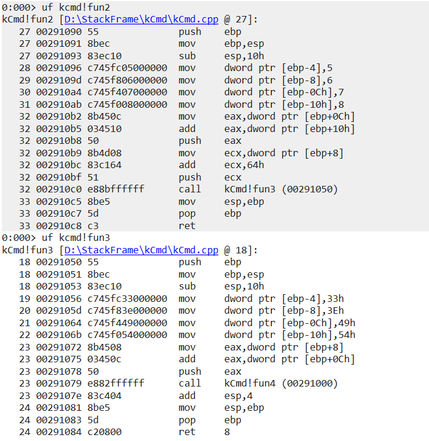

# Debugger Commands

**Table of Content**

* [**Help command**](#help-command)
* [**!analyze -v command**](#!analyze-v-command)
* [**Sympath command**](#sympath-command)
* [**Setting symbol path**](#setting-symbol-path)
* [**Debugger extensions**](#debugger-extensions)
* [**x command**](#x-command)
* [**ln command**](#ln-command)
* [**r command**](#r-command)
* [**k command**](#k-command)
* [**e command**](#e-command)
* [**u command**](#u-command)
* [**dc command**](#dc-command)
* [**dt command**](#dt-command)
* [**dv command**](#dv-command)
* [**'s' command**](#'s'-command)
* [**bp command**](#bp-command)
* [**t command**](#t-command)
* [**p command**](#p-command)
* [**gu command**](#gu-command)
* [**wt command**](#wt-command)
* [**.logopen command**](#t,p,.logopen-command)
* [**ChildEBP,retAddr,argstochild**](#childebp,retaddr,argstochild)
* [**Address Range**](#address-range)
* [**pipe command**](#pipe-command)
* [**version,vertarget commands**](#version,vertarget-commands)

## **Help command**

The Help command has the information about other commands.

we can launch help content in two ways.

**1. By clicking on help button.**

* Launch windbg application and select Local help button ,opens the Debugging Tools for Windows documentation.


* If you specify Text, the debugger opens the Index panel in the documentation and searches for Text as a keyword in the index.


**2. By .hh command**

* To use `.hh` command , Attach an notepad process to the debug(to attach notepad launch the notepad first).

* Click on File -> Attach to process -> notepad.exe -> attach 


* use `.hh` command to open the Debugging Tools for Windows documentation.

```markdown
.hh
```


* If you specify Text, the debugger opens the Index panel in the documentation and searches for Text as a keyword in the index.


**Example:**

```text
 Attach Process: 
        load notepad example

    > .hh
        Debugging Tools for Windows documentation

    > qd
        detach the process

```

## **!analyze -v command**

[click here for reference program](https://github.com/PadmanabhanSaravanan/windbg_Intro/tree/master/HelloWorld)

The `!analyze -v` command in WinDbg is a powerful automated debugging command that performs an analysis of the current state of the program being debugged, typically after an exception or crash.

```markdown
!analyze -v
```

Here's a breakdown of the command:

* **!analyze**: This is the basic automated analysis command. It performs an initial analysis of the state of the program.
* **-v**: This is an option that stands for "verbose". When you use -v with !analyze, the command provides more detailed output.

In the context of crash dump analysis, !analyze -v is often the first command you'd run after loading the crash dump.


**1. The first thing you see is a statistics of the debugging session**


**2. Global flag, a debugging flag which is associated with the user**


**3. Some of the debugging related information comes here**


**4. Exception record gives you information about the exception which has occurred**


**5. Thread ID of the faulting thread and exception code**


**6. Call stack gives you the picture of how the code path reached the exception point**


**Example:**

```text
open executable:
    open helloworld executable(.exe)

    > g
        continue and we have a breakpoint.

    > !analyze -v
        performs an analysis of the current state.

    > ~0s ; .cxr ; kb  (stack command.)
         ~0s switching the thread to zero thread.
         .cxr setting the context to exception context.
         kb call stack command

    > .dump /ma pathofdump
        take dump of the application
        /ma full dump
        pathofdump example "c:\path_to_dmp_file\abc.dmp"

    > qd 
        detach the executable.

    > attach dump 
            open the crash dump from the file path it is saved.

    > lm 
        list of modules.

    > !analyze -v 
        performs an analysis of the current state of the dump.

    > qd 
        detach the dump.
```

## **Sympath command**

The sympath command in WinDbg is used to display or set the symbol file path for the debugger. The symbol path tells the debugger where to find the symbol files (.pdb files) that correspond to the executable files (.exe, .dll files) that you are debugging.

1. **`.sympath` -> To display the current symbol path**

```markdown
.sympath
```


2. **.sympath, say "C:/temp" , it will set the symbol path to "C:/temp".**

* `.sympath "C:/temp"`

```markdown
.sympath "C:/temp"
```


3. **again check symbol path it will be set to c:/temp**


Example:

```text
attach dump 
    open the crash dump from the file path it is saved.

    > .symapath 
        To display the current symbol path

    > .sympath "C:/temp"
        set the symbol path to "C:/temp"

    > .sympath
        check the symbol is set to the defined path

    > qd 
        detach the dump
```

## **Setting symbol path**

* Open a execuatble file, file -> launch executable -> select the .exe file -> open.


* `lm` command -> loaded modules, if we check the module has a pdb symbol and the symbol is present in this particular path.


* take a copy **.pdb** file and save it for further reference

* next we will **rename .pdb file** from the project and **delete the cache** from the mentioned module path. i.e., **C:\ProgramData\Dbg\sym\HelloWorld.pdb\09F43444E582442E929DEDF81F87033D6\HelloWorld.pdb**

* now check the modules the symbol folder will not be loaded.


* To load the symbol file,create new folder in project named cssym(custom symbol path).


* paste the .pdb file in cssym folder ,which was copied before.


* copy the file path were .pdb file is pasted and load the sympath and use lm command to check symbols are loaded.

```markdown
.sympath srv*;D:\StudentRequest_ForDren\WindbgIntro\HelloWorld\cssym
```


**Note**

Executable file and symbol file time stamp should be same.

**Example:**

```text
open executable:
    open helloworld executable(.exe)

    > g
        continue and we have a breakpoint

    > lm 
        loaded modules(scroll to left we cans see the symbols present and it's path)

    > .hh 
        - open windbg documentation in index search msdl
        - you can see where default cache symbol path will be stored

    > .sympath 
        you can see where default cache is coming from

    > qd 
        detach the executable.

    > go to the project folder and rename the symbol file(.pdb) , before renaming take a copy of the file.
            symbol file will be present where executable file is present.

    > delete the cache 
            - take the file path from the loaded module and delete the symbol file.

open executable:
    open helloworld executable(.exe)

    > g
        continue and we have a breakpoint

    > k 
        list of call stack (we cannot see any function names)

    > lm 
        loaded modules(scroll to left we cannot see symbols present)

    > qd 
        detach the executable.

    > create a file name cssym(custom symbol path) to the project.

    > paste the symbol file(.pdb) to the cssym folder.

open executable:
    open helloworld executable(.exe)

    > g
        continue and we have a breakpoint

    > .sympath srv*;path of symbol
        srv* the debugger uses a symbol server to get symbols from the default symbol store.
        path of symbol C:/helloworld/cssym

    > lm 
        loaded modules(scroll to left we cans see the symbols present and it's path)
        defered means it has not tried to load the symbols
        no symbols means that it tried to load the symbols and it didn't get the symbols
     
    > lmvm HelloWorld
        we can see whether the symbols are there or not.

    > qd 
        detach the executable.
```

## **Debugger extensions**

Debugger extensions in WinDbg are powerful tools that can extend the basic capabilities of the debugger. They provide additional commands and utilities for specific debugging tasks.

Extensions are plugins to the Debugger, so they add functionality to the Debugger or the base functionality is extended using the Extension commands.

**.chain command**

* The `.chain` command in WinDbg displays the list of all loaded debugger extensions. When you issue this command, WinDbg will show you a list of all debugger extensions that have been loaded into the current debugging session, including their load addresses and versions.

```markdown
.chain
```


**.load command**

* To load an extension in WinDbg, you can use the .load command, followed by the path to the extension DLL. For example, to load the SOS extension.

```markdown
.load C:\Windows\Microsoft.NET\Framework\v4.0.30319\SOS.dll
```

* check the extension file loaded using `.chain` command.


**.unload command**

The .unload command in WinDbg is used to unload a debugger extension DLL.

```markdown
.unload C:\Windows\Microsoft.NET\Framework\v4.0.30319\SOS.dl
```


**Example:**

```text
open executable:
    open helloworld executable(.exe)

    > .chain
        current extensions loaded

    > .load C:\Windows\Microsoft.NET\Framework\v4.0.30319\SOS.dll
        - C:\Windows\Microsoft.NET\Framework\v4.0.30319\SOS.dll - .NET installation path

    > .chain 
        we can see the .NET extension loaded

    > !help 
        it will show you the latest loaded extensions

    > !sos.help
        it will also show the extension details

    > .extmatch /D /e dbghelp *
        These are the different commands which are available in the debug Help extension
        - in the list of loaded extensions, click on the extension you can see the different commands which are available.
    
    > .unload C:\Windows\Microsoft.NET\Framework\v4.0.30319\SOS.dl
        unload the extension

    > .chain
        to check whether extension is unloaded.

    > qd 
        detach the executable.
```

## **x command**

* The x command is used to display symbols that match a specific pattern. 

* It has the following syntax:

```markdown
x [Options] Module!Symbol
```

```markdown
x HelloWorld!*main*
```


**Note**

```text
If commands not executing properly or symbols files not loaded then to do this setting in visual studio
            open project - right click on project - properties - linker - debugging - Generate debug info - Generate debug information optimized for sharing and pulishing

```

**Example:**

```text
open executable:
    open helloworld executable(.exe)

    > g 
        continue and we have a breakpoint

    > x HelloWorld!*main*
        it'll give you addresses of the matched symbols.
        HelloWorld - name of the binary.
        *main* - display main function inside the binary

    > lm 
        load modules 
        all these addresses are in this particular range of the binary

    > bp HelloWorld!wmain
        breakpoint
        we can put breakpoints from address which are listed

    > x HelloWorld!?main
        This will give a little more fine grained result

    > qd 
        detach the executable
```

## **ln command**

* The ln command is used to display the symbol nearest to a given address. It is typically used to determine what code or data is at a particular address. 

* It has the following syntax:

```markdown
ln [Address]
```


**Example:**

```text
open executable:
    open helloworld executable(.exe)

    > g 
        continue and we have a breakpoint

    > lm 
        loaded modules

    > x HelloWorld!?main
        This will give a little more fine grained result

    > ln address
        address from the main 

    > qd 
        detach the executable
```

## **r command**

* The r command in WinDbg is used to display or modify the contents of registers. 

* It has the following syntax:

```markdown
r [Register [= [Expression]]]
```

**The command can be used in several ways:**

**1. Display all registers:**

* If you use the `r` command without any arguments, it displays the contents of all registers.

* This command will show the contents of all the registers for the current thread, including general-purpose registers, segment registers, flags, instruction pointer, and more.

```markdown
r
```


**2. Display a specific register**: 

* You can use the r command followed by a register name to display the contents of a specific register. For example, to view the contents of the eax register.

```markdown
r eax
```


**3. Modify a register:** 

* You can also use the r command to modify the contents of a register. To do this, you provide the register name followed by the new value. For example, to set the eax register to 0.

```markdown
r eax = 0
```


The `~*r` command in WinDbg displays the register context for all threads in the system.

```markdown
~*r
```

**Example:**

```text
open executable:
    open helloworld executable(.exe)

    > g 
        continue and we have a breakpoint

    > r 
         displays the contents of all registers

    > r eax
        view the contents of the eax register

    > r eax = 0
        modify the contents of a register

    > .hh r
        documentaion of the register
    
    > ~
        all the thread

    > ~1s 
        switch to the thread number 1

    > r
        different set of registers because the thread context has changed

    > ~*r 
        displays the register context for all threads in the system

    > qd 
        detach the executable
```

## **k command**

* The k command in WinDbg displays a stack trace of the current thread. It shows the sequence of function calls that the thread has made up to the point where it currently is.

```markdown
k
```


* The `.frame` command in WinDbg is used to set or display the current local context to a specific frame number.

```markdown
.frame <frame-number> ;dv
```


* `kvn` this command will show you the arguments to the child as well.

```markdown
kvn
```


* `kf` this command will show you the memory offset size for each frame.

```markdown
kf
```


* `~*k` command in WinDbg displays a stack trace for all threads in the system.

```markdown
~*k
```

**Example:**

```text
open executable:
    open helloworld executable(.exe)

    > g 
        continue and we have a breakpoint

    > k
        list of call stack of current thread

    > ~1s 
        switch to the thread number 1

    > k 
        list of call stack of thread 1

    > click on the dml that is frame number
        displays local variable

    >.frame 05;dv
        .frame 05 select the frame number
        dv - displays local variable

    >.frame 05;dv /V
        /V - gives more information about the stack

    > kvn 
        show you the arguments to the child as well

    > kf 
        show you the memory offset size for each frame

    > .hh k
        documentation of k command

    > ~*k
        displays a stack trace for all threads in the system

    > qd 
        detach the executable
```

## **e command**

The `e` command in WinDbg is used to enter values into memory at a specified location. It has the following syntax:

```markdown
e[d|q|p|a|u|f] [Address] [List]
```

-> e is the basic command for entering values into memory. By itself, e enters 4-byte hexadecimal values.

-> The optional character after e specifies the format of the data to enter:

* d enters 4-byte decimal integers.
* q enters 8-byte hexadecimal integers.
* p enters a pointer value.
* a enters an ASCII string.
* u enters a Unicode (UTF-16) string.
* f enters floating-point values.

-> Address is the memory location where you want to start entering data.

-> List is the data you want to enter, separated by spaces. The data should be in the format specified by the character after e.

**Example:**

* setting breakpoint in mytest function

```markdown
bp helloworld!MyTestFunc
```

* use `g` command to continue and it breaks at the breakpoint and step into the printf line.


* use `k` command to view the particular stack frame.


* click frame number 00 you can see there the string is helloworld.


* now i'm changing hello string to jack using `e` command

```markdown
ea 0x008eee58 "jack"
```

* and use the previous command to check it is edited.


```text
open executable:
    open helloworld executable(.exe)

    > bp helloworld!MyTestFunc
        setting break point on MyTestFunc

    > g 
        continue and we have a breakpoint

    > p
        step over

    > k 
        stack frame

    > click frame number 00 you can see there the string is hello world and it's address

    > ea address "jack"
        ea edit ascii
        address - address of the string helloworld
        "jack" editing hello world to jacko world

    > again click frame number 00 you can see there the string as been changed to jacko world.

    > g 
        continue you see in console jacko world

    > .hh e
        documentation on edit memory

    > qd 
        detach the executable
```

## **u command** 

The u command in WinDbg is used to disassemble and display a range of memory as CPU instructions (i.e., assembly code). This command is typically used to inspect the instructions that a program will execute.

 

**ub command:**

The ub command in WinDbg is used to disassemble and display a range of memory as CPU instructions in reverse order. The command stands for "unassemble backward".


**uf command**

The uf command in WinDbg is used to disassemble and display a complete function in assembly language. This command stands for "unassemble function".


```text
open executable:
    open helloworld executable(.exe)

    > g 
        continue and we have a breakpoint

    > u 
        assemble a bunch of instructions starting from the current eip

    > r
        check whether it is starting from current eip

    > u address L20
        address - specify the address from the u command
        L value argument
        20 means 20 dwords , dwords*4 = 80 bytes

    > ub address L20
        displays in backward

    > uf HelloWorld!wmain
        HelloWorld!wmain - function
        assembly instruction for that particular function

    > uf /c HelloWorld!wmain
        /c it will show you all the call outs

    > qd 
        detach the executable
```

## **dc command**

The **dc command** in WinDbg is used to display memory in a formatted view. The dc command stands for "Display Memory as Double Words with ASCII characters". Double words are 4 bytes long, so each line of the output shows a sequence of double words, and also their ASCII interpretations.

```markdown
dc <Address>
```


**dps command**

The dps command in WinDbg is used to display memory, interpret data as both symbols and hexadecimal values, and display the resulting ASCII strings. The dps command stands for "Display Pointer-sized values with Symbols".


**Example:**

```text
open executable:
    open helloworld executable(.exe)

    > g 
        continue and we have a breakpoint

    > dc address
        address - specify address where you need to display memory

    > dc staring_address end_address
        displays memory between staring_address & end_address

    > dc address L20
        L20 - 20 means 20 dwords , dwords*4 = 80 bytes.

    > dv 
        local variable 

    > dc address
        address - local variable string address
        you can see the ascii value

    > db address
        address - local variable string address
        it will show information in bytes

    > dps address
        it will show you the pointer sized value of the address with symbols

    > !teb 
        displays stack limit and stack base

    > dps stackbase stacklimit
        raw dumping of the stack

    > qd 
        detach the executable
```

## **dt command**

[click here for reference program](https://github.com/PadmanabhanSaravanan/windbg_Intro/tree/master/Structdt)

The dt command in WinDbg is used to display type information, which includes the structure of data types and the values of variables or data structures. This command is especially useful for inspecting complex data types like structures, unions, classes, and so on.


**Recursive Dumping**

The term "recursive dumping" in WinDbg refers to the process of inspecting or displaying the contents of complex data structures that may include other nested data structures. This process involves not just displaying the top-level structure, but also displaying the contents of any nested structures.

**Example:**

```text
open executable:
    open structdt executable(.exe)

    > g 
        continue and we have a breakpoint

    > dv 
        display local variables

    > click on mystr
         It evaluates expressions and displays the results in a variety of formats

    > dt kcmd!MY_STRUCT
        display the type information

    > dt kcmd!MY_STRUCT address
        address - pmystr address(information from dv)

    > !peb
        process environment block
        The PEB is a data structure in the Windows operating system that contains data related to the executable image of a process, such as its image base address, command line, start-up information, data structures for the program's image loader, and more.

    > dt address ntdll!_PEB
        address - address from !peb (mentioned in first line)
        ntdll!_PEB - Process Environment Block (PEB) data structure in the ntdll

    > dt -r4 address ntdll!_PEB
        -r recursively displaying nested structures
        4 - 4 level deep recursive dumping

    > qd 
        detach the executable
```

## **dv command**

[click here for reference program](https://github.com/PadmanabhanSaravanan/windbg_Intro/tree/master/StackFrame)

The dv command in WinDbg is used to display local variables and their values for the current function in the call stack.


**Example:**

```text
open executable:
    open stackframe executable(.exe)

    > g
        continue and we have a breakpoint

    > k 
        list of call stack frames

    > .frame 03
        switch into that particular frame

    > dv /V 
        we can see all the required information

    > qd 
        detach the executable
```

## **'s' command**

The s command in WinDbg is used to search memory in a range of addresses for a pattern.

The command has the following syntax

```markdown
s [-[w|d|q|a|u|f]] Range Pattern
```

* -w specifies 2-byte word values.
* -d specifies 4-byte double word values.
* -q specifies 8-byte quad-word values.
* -a specifies ASCII string.
* -u specifies Unicode (UTF-16) string.
* -f specifies floating-point number.

Range specifies the range of memory to search, and Pattern is the data you are looking for.

Example:

```markdown
s -a 0 L?7fffffff "hello"
```


**Example:**

```text
open executable:
    open helloworld executable(.exe)

    > g
        continue and we have a breakpoint

    > s -a 0 L?7fffffff "hello"
        s - search
        a - ascii
        0 - 0th address
        ? - to search very large range of address
        7fffffff - entire user mode address range
        "hello" - ascii value to search 
    
    > dv 
        see address of the local variable and check whether it is there in the search

    > .hh s 
        documentation on search

    > qd 
        detach the executable
```

## **bp command**

The bp command in WinDbg is used to set a breakpoint at a specified location. Breakpoints are a common debugging tool that allow you to pause the execution of a program at a specific point, so you can inspect the state of the program at that point.

```markdown
bp [options] [Address [Passes] [CommandString]]
```

* options are optional parameters that control how the breakpoint behaves.
* Address is the memory address where you want to set the breakpoint. This can also be a function name or a source line, if you have symbol and source information.
* Passes is the number of times the breakpoint should be ignored before it triggers. This is optional.
* CommandString is a command or sequence of commands that WinDbg should execute when the breakpoint triggers.

```markdown
bp HelloWorld!wmain
```


```text
open executable:
    open helloworld executable(.exe)

    > x HelloWorld!*main*
        this will give us all the potential mains

    > bp HelloWorld!wmain
        break point at main function

    > g
        you can see break point is hit

    > bl
        list the break point 

    > bc 0 
        remove break point.

    > qd
        detach the executable

    > make changes in code(add the below code) 
        int a = 0;
        int b = 0;
        int c = a/b;

    > build the executable file

open executable:
    open helloworld executable(.exe)

    > bp HelloWorld!MyTestFunc "dv /V;k;gc"
        dv /V - displays local variable
        k - call stack
        gc - go from conditional breakpoint

    > g
        throws a exception divide by 0
        you can see the local variables and call stack

    > bl 
        list of breakpoints

    > bd *
        disable all the breakpoints(even we can mention breakpoint number instead of *)

    > be * 
        enable all the breakpoints(even we can mention breakpoint number instead of *)

    > qd 
        detach the executable
```

## **t command**

The t command in WinDbg is used to execute a single instruction and then pause, also known as "step into". This allows you to follow the execution of a program line by line, and it will also follow execution into called functions.

```markdown
t
```


**Example:**

```text
open executable:
    open helloworld executable(.exe)

    > x HelloWorld!*main*
        this will give us all the potential mains

    > bp HelloWorld!wmain
        break point at main function

    > g
        you can see break point is hit

    > t 
        step into
    
    > qd
        detach the executable
```

## **p command**

The p command in WinDbg is used to "step over" a function or instruction. This means it will execute a single line or instruction in your code, but if that instruction is a function call, it will execute the entire function and then pause, rather than stepping into the function.

```markdown
p
```


**Example:**

```text
open executable:
    open helloworld executable(.exe)

    > x HelloWorld!*main*
        this will give us all the potential mains

    > bp HelloWorld!wmain
        break point at main function

    > g
        you can see break point is hit

    > p 
        step over
    
    > qd
        detach the executable
```

## **gu command**

The gu command in WinDbg stands for "Go Up", which executes until the current function is complete and returns,also known as "step out".

```markdown
gu
```

**Example:**

```text
open executable:
    open helloworld executable(.exe)

    > x HelloWorld!*main*
        this will give us all the potential mains

    > bp HelloWorld!wmain
        break point at main function

    > g
        you can see break point is hit

    > gu 
        step out
    
    > qd
        detach the executable
```


## **wt command**

The wt command in WinDbg stands for "Watch and Trace". This command executes the specified function, or the function at the current instruction pointer if no function is specified, and then provides a summary of the function's execution.

```markdown
wt
```

**Example:**

```text
open executable:
    open helloworld executable(.exe)

    > g
        continue and we have a breakpoint

    > wt 
        displays watch trace
    
    > qd
        detach the executable
```


## **.logopen command**

The .logopen command in WinDbg is used to start logging all debugger input and output to a specified file.

**Syntax:**

```markdown
.logopen FileName
```

```markdown
.logopen D:\Windbg\op.txt
```

use .logclose command to close the file

```markdown
.logclose
```


```text
open executable:
    open helloworld executable(.exe)

    > g
        continue and we have a breakpoint

    > .logopen filepath
        filepath D:\example\log.txt
        creates the file and enters the log

    > wt 
        displays watch trace

    > k
        call stack

    > .logclose 
        close the log file
    
    > qd
        detach the executable

    > open log.txt and you can see logs will be printed
```

## **ChildEBP,retAddr,argstochild**

While looking at call stack we will these three values i.e., **ChildEBP , retAddr and argstochild**.


**ChildEBP**

* ChildEBP is nothing but the saved ebp, with this we can get a lot of information,all the stack frame is accessed using the ebp, that is the ChildEBP.
* EBP is a register in the x86 architecture which stands for "Extended Base Pointer". This register is typically used to hold the base address of the current stack frame.
* When a function is called in a program, a new stack frame is created to hold the function's local variables and some other information. The EBP register is set to point to the base of this stack frame, which allows the function to correctly reference its local variables and arguments.

**retAddr**

* retAddr, short for "Return Address", typically refers to the memory address to which a function is supposed to return control after it finishes executing.
* When a function is called in a program, the address of the instruction immediately following the call is pushed onto the stack. This is the return address. After the function completes, it pops this address off the stack and jumps to it, thereby returning control to the point in the code where it was called.

**argstochild**

* argstochild typically refers to the arguments that are passed from a parent function to a child function in a function call.
* When a function is called in a program, the arguments to the function are typically pushed onto the stack, in reverse order (from last to first). These become the argstochild for the function being called (the child function).

## **Address Range**

The term "Address Range" generally refers to a contiguous block of addresses in memory, specified by a starting address and an ending address.

In the context of programming or debugging, an address range could be used to represent various things, such as:

* The range of addresses occupied by a function or a block of code.
* The range of addresses allocated for a buffer or an array.
* The range of addresses covered by a memory mapping.

**!teb** - this is a command to get the stack base and stack limit, so this is a property of the thread.

```markdown
!teb
```


we can check difference between stack base and stack limit

```markdown
?stackbase-stacklimit
```


I got 12288, this many bytes is the difference between these two addresses.

Example:

```text
open executable:
    open helloworld executable(.exe)

    > g
        continue and we have a breakpoint

    > !teb 
        thread environment block
        it displays stack base and stack limit
    
    > ?stack_base-stack_limit
        we can check difference between stack base and stack limit
    
    > qd
        detach the executable
```

## **pipe command**

* pipe command will show you information about the debuggee.

```markdown
|
```


* this is the binary which is being debugged.

* double pipe command gives mode of debugging.

```markdown
||
```


**Example:**

```text
open executable:
    open helloworld executable(.exe)

    > g
        continue and we have a breakpoint

    > | 
        information about the debuggee

    > || 
        mode of debugging
    
    > qd
        detach the executable
```

## **version,vertarget commands**

The **version** command in WinDbg provides information about the version of the debugging tools being used, as well as the version of the target being debugged.

```markdown
version
```


The **vertarget** command in WinDbg provides information about the target system being debugged.

```markdown
vertarget
```


**Example:**

```text
open executable:
    open helloworld executable(.exe)

    > g
        continue and we have a breakpoint

    > version 
        information about the version of the debugging tools being used

    > vertarget 
        information about the target system being debugged
    
    > qd
        detach the executable
```

## Looping- foreach command

The .foreach command in WinDbg is a powerful command used to iterate over a set of data or objects and execute a command or series of commands on each.

Here's the basic syntax of the .foreach command:

```markdown
.foreach ( PlaceHolder { Command } ) { Commands }
```

* PlaceHolder is a name that holds the value of the current object in the iteration.
* The first Command is used to get the set of objects to iterate over. This command should return a list of values or addresses.
* The Commands inside the second pair of curly braces are the commands to be executed for each object in the set. You can refer to the current object using the PlaceHolder name.

```markdown
.foreach /f (place "D:\Test.txt") { .echo place }
```

create text file name Test.txt and run the command


```markdown
.foreach /f (place "D:\Test.txt") { dc place }
```


```markdown
.foreach /f (place "D:\Test.txt") { .echo new start; .echo place ;dc place }
```


**!for_each**

In WinDbg, !for_each is a very useful command that can be used to iterate over a set of elements and execute commands for each element. However, please note that !for is not a standalone command, it's usually used in the context of other commands.

Here is the syntax for the !for_each command:

```markdown
!for_each [frame | local | global] <VariableName> <CommandString>
```

```markdown
!for_each_frame !for_each_local dt @#Local
```


**Example:**

```text
open stackframe executable(.exe)

    > g
        continue and we have a breakpoint

    > .hh
        opens documentation window

    > in index search .foreach you can see syntax and usage.

    > create a text file and write random text and save(Test.txt).

    > .foreach /f (place "D:\Test.txt") { .echo place }
        this command iterates and output text present in the file

    > k
        list of call stack

    > in the created text file add the address of the stack.

    > .foreach /f (place "D:\Test.txt") { dc place }
        command will display the memory

    > .foreach /f (place "D:\Test.txt") { .echo new start; .echo place ;dc place }
        this command will iterate according to the command

    > .hh
        opens documentation window

    > in index search !for you can see syntax and usage.

    > !for_each_frame !for_each_local dt @#Local
        command displays all local variables for the current stack

    > !for_each_module .echo @#Base @#End
        this command will display loaded modules
        @#Base base address
        @#End end 
        
    > lm 
        list of modules
        cross verify the above value with the lm command output
    
    > qd
```

# Additional Breakpoints

* [**Conditional Breakpoint**](#conditional-breakpoint)
* [**Symbol breakpoint**](#symbol-breakpoint)
* [**Breakpoint Unresolved**](#breakpoint-unresolved)
* [**Break on Access**](#break-on-access)

## **Conditional Breakpoint**

* Breaks only if a condition is true
* Use to filter out the unnecessary breaks of bp, bm, bu, ba variant.
* A small “program” is given with the breakpoint command which decide to break or not.
* We can even use the program to print the stack on break and just “go”
* Its always better to use gc than g to go from a conditional break.

```markdown
bp HelloWorld!MyTestFunc ".if ( poi(testVar)>0n1500) {} .else {gc} "
```

* bp – breakpoint command
* HelloWorld!MyTestFunc – function argument ,where breakpoint should be applied.
* .if & .else – if else statement
* poi - Pointer-sized data from the specified address
* gc - command resumes execution from a conditional breakpoint

Example:

```text
open helloworld executable(.exe)

    > dt testVar
        check the initial Variable value

    > bp HelloWorld!MyTestFunc ".if ( poi(testVar)>0n1500) {} .else {gc} "
        break only if test var is greater than 1500 or continue

    > g 
        comtinue

    > dt testVar
        check the initial Variable value

    > testVar value is greater than 1500 and it is breked.

    > .restart
        restart the application

    > bp HelloWorld!MyTestFunc ".if ( poi(testVar)>0n1500) {} .else { k;gc } "
        this command will print call stack when breakpoint is hit

    > qd

```

## **Symbol breakpoint**

Symbolic breakpoints(bm) are particularly useful when you don't have a specific address to break on, but you do know the name of the function or method where you want execution to stop.

The syntax for the bm command is as follows:

```markdown
bm [Options] Symbol
```

```markdown
bm kmcd!fun*
```


Example:

```text
open stackframe executable(.exe)

    > bm kmcd!fun*
        All the fun* symbols, it has put breakpoint on

    > x kcmd!fun*
        we will get all the function variable

    > g
        continue and it hits breakpoint on fun

    > qd

```

## **Breakpoint Unresolved**

The bu command in WinDbg is used to set an unresolved breakpoint. This is particularly useful when you want to set a breakpoint on a function or method in a module (DLL or EXE) that has not been loaded yet.

Breakpoint unresolved will anticipate a binary load and will put a breakpoint in advance

The syntax for the bu command is as follows:

```markdown
bu [Options] Address [Passes] ["CommandString"]
```

```markdown
bu comdlg32!DllMain
```

* breakdown on the unloaded binary

Here:

* Address is the memory address or symbol where you want to set the breakpoint.
* Options, Passes, and CommandString are optional parameters.

**Example:**

```text
 Attach Process: 
        load notepad

    > you can see the binary which are loaded

    > g 
        continue

    > open notedpad file -> open in windbg you can see the binary are loading suddenly(these are the unloaded binary)

    > I will use the first dll which is getting loaded when I open the file open dialog box

    > break (Alt + Delete)

    > qd 
        deatch the process

    Attach Process again: 
        load notepad

    > bu comdlg32!DllMain
        breakpoint on the unloaded binary

    > g
        continue

    > open notedpad file -> open
        we can see the breakpoint is it.

    > k
        I will see the loading call path,so this is how the handler of that button so it is starting from winproc to all the way from combase to load library.

    > kvn 
        to check the dll load

    > qd
        detach the process

```

## **Break on Access**

The ba command in WinDbg stands for "Break on Access". It sets a breakpoint at a specified location in memory. This command is especially useful when you want to stop execution when a specific memory location is accessed or modified.

The syntax for the ba command is as follows:

```markdown
ba [Options] Access Size Address [Passes] ["CommandString"]
```

Here:

* Access specifies the type of memory access that causes the breakpoint to be triggered: e (execute), r (read), or w (write).
* Size is the size of the memory range that's being watched.
* Address is the memory address at which the breakpoint is set.

**Example:**

```text
open helloworld executable(.exe)

    > bp HelloWorld!wmain
        breakpoint on main function.

    > g
        continue and breakpoint hit

    > dv /V
        we address of the variable

    > ba r4 address
        address - address of initi variable
        r - read or write
        4 - four bytes

    > g
        continue and it will hit a break point on the variable
        it is not exactly breaking there is because the CPU is executing the instructions out of order

    > g
        getting the correct instruction here

    > ?ebp-014h
        we can see where the breakpoint is hitting (that is the breakpoint on the variable address)

    > qd

```

# Call Stack and Thread Analysis

* [**Understanding the call stack and stack frames**](#understanding-the-call-stack-and-stack-frames)
* [**Viewing and navigating the call stack**](#viewing-and-navigating-the-call-stack)
* [**Thread**](#thread)
* [**Analyzing thread information**](#analyzing-thread-information)

## **Understanding the call stack and stack frames**

**Call Stack**

* The call stack is a fundamental concept in debugging that provides valuable information about the sequence of function calls and their associated return addresses during program execution. 
* It allows developers to trace the flow of execution, understand the order of function calls, and identify the path leading to the current point of code execution.

**stack frames**

A call frame, or stack frame, is a data structure that contains information about a single function call. Each time a function is called, a new call frame is created on the call stack to store relevant information such as local variables, function parameters, and the return address.


## **Viewing and navigating the call stack**

**call stack**

view the call stack using k command.


use kvn command to view Args to Child


**Stack frame**

Switching into stack frame (.frame )


use the dv (Display Local Variables) command to view the local variables and function arguments for that function


**Example:**

```text
Launch Executable:
    launch helloworld executable(release)

    > bp HelloWorld!wmain
        breakpoint on main function

    > g 
        conitnue and breakpoint hit

    > k 
        list of stacks

    > kvn
        display a stack trace with frame numbers, module names, function names, and source line 
        numbers for each call on the stack.

    > .frame 00
        switch into particular frame

    > dv /V 
        view the local variables and function arguments for that function

    > qd
        detach the executable

```

## **Thread**

* Threads are  nothing but a  group of CPU instruction  guaranteed  to execute in  the order we  are giving.
* Thread stack help to maintain  the  order of  execution and have  local variables.


## **Analyzing thread information**

[click the link for reference program](https://github.com/PadmanabhanSaravanan/windbg_Intro/tree/master/Threads)

**~ (Tilde) Command:**

The tilde command lists all the threads in the target process, along with their thread IDs (TIDs) and processor (CPU) affinity.


**~*k Command:**

This command will list all the threads with call stack.


**~*r Command:**

This command will list all the threads with registers.


**!teb command**

Thread environment block:

The Thread Environment Block (TEB) is a data structure in Windows operating systems that contains information related to the currently running thread, including thread-local storage, structured exception handling, stack bounds, and more.


**Example:**

```text
Launch Executable:
    launch thread executable(release)

    > ~ 
        lists all the threads in the target process

    > *k
        list all the threads with call stack

    > *r
        list all the threads with registers

    > !teb
        thread environment block

    > bp Threads!printNumbers ".if ( poi(isEven)=1) {} .else {gc} "
        put breakpoint if isEven = true

    > qd 
        detach the process

```

# Assembly Language

* [**Assembly**](#assembly)
* [**Understanding Assembly Launguage**](#understanding-assembly-launguage)

## **Assembly**

**Why do we need?**

* Reverse engineering or understand the flow in other modules and functions.
* Finding the arguments from stack

-> Sparingly used.

-> Tedious and time consuming but at time in evitable.

-> Last resort.

-> Only some 10% or small subset of it is needed for our purpose.

-> How the stack is maintained is one off the major focus.

## **Understanding Assembly Launguage 32bit**

* [**Registers**](#registers)
* [**Basic instructions**](#basic-instructions)
* [**Stack handling of windows compiler**](#stack-handling-of-windows-compiler)
* [**Calling conventions**](#calling-conventions)
* [**Demo**](#demo)


### **Registers**

Registers are a small amount of storage available as part of a computer's CPU (Central Processing Unit). They are used to quickly store and retrieve data during a program's execution. The number and type of registers vary depending on the architecture of the CPU, but they often include:

**1. General-Purpose Registers:** These can be used for any data manipulation operation. Examples include EAX, EBX, ECX, EDX in the x86 architecture.

**2. Instruction Pointer:** Also called a program counter, this register points to the next instruction to be executed. EIP (Extended Instruction Pointer) is used in x86.

**3. Stack Pointer:** This points to the top of the current stack frame. ESP (Extended Stack Pointer) is used in x86.

**4. Base Pointer:** Also called a frame pointer, this points to a fixed location within a stack frame. EBP (Extended Base Pointer) is used in x86.


**Example**

```text
Use StackFrame program

    > first we need to make some changes to the program
        - in fun3 add __stdcall (void __stdcall fun3(int i,int j){ }).  __stdcall is the calling covention.
        - In project properties C/C++ -> Optimization -> diabled & Inline Function Expansion -> disabled(platform 32)
        - build it in release mode 32bit for debugging.

Launch Executable:
    launch stackframe executable(release)

    > bp kcmd!wmain
        breakpoint to the main function

    > g
        continue and breakpoint hits

    > r 
        to see the registers
```

### **Basic instructions**

use uf command to see the assemby instruction.

```markdown
uf kcmd!wmain
```

the example shows the machine-level representation of the wmain function from the kCmd module in your program.


**Understand the assemby instruction**

**1. push ebp**: This is the start of the function prologue. It's saving the old base pointer value onto the stack so that it can be restored later. The base pointer is used to reference local variables and function arguments.

**2. mov ebp, esp**: This is the second part of the function prologue. It's setting the base pointer to the current stack pointer, which effectively creates a new stack frame for this function.

**3. push 8Bh, push 12Ch, push 0C8h, push 64h**: These instructions are pushing the hex values 8B, 12C, 0C8, and 64 onto the stack. These are likely arguments to the function fun1.

**4. call kCmd!fun1**: This instruction is calling the fun1 function, passing it the arguments that were just pushed onto the stack.

**5. add esp,10h**: This instruction is cleaning up the stack after the call to fun1. It's adding 0x10 (or 16 in decimal) to the stack pointer, effectively removing the four arguments that were pushed onto the stack before the fun1 call.

**6. xor eax,eax**: This instruction is setting the eax register to 0. The xor operation is a common way to zero a register in assembly. The eax register is typically used to hold a function's return value, so this could be setting the return value of wmain to 0.

**7. pop ebp**: This is the start of the function epilogue. It's restoring the old base pointer value from the stack, returning us to the parent stack frame.

**8. ret**: This is the end of the function. It's returning control to the function that called wmain, popping the return address from the stack and jumping to it.

```text
Launch Executable:
    launch stackframe executable(release)

    > bp kcmd!wmain
        breakpoint to the main function

    > g
        continue and breakpoint hits

    > uf kcmd!wmain 
        to see the assembly instructions

```

### **Stack handling of windows compiler**

When a function is called in a C or C++ program on Windows, the function's prologue and epilogue handle setting up and tearing down the stack frame for that function. Here's how it generally works:

In the above assemby instruction first two line is function prologue and last two line is function epilogue.

**Function Prologue:**

* **Push Old Base Pointer onto Stack:** The function starts by saving the old base pointer (ebp on x86, rbp on x64) onto the stack with a push instruction. This allows the function to be reentrant or recursive, and allows for the previous state to be restored later.

* **Set New Base Pointer:** Next, the function sets the base pointer to the current stack pointer (esp on x86, rsp on x64) with a mov instruction. This establishes a fixed reference point in the stack for accessing function parameters and local variables.

* **Allocate Space for Local Variables:** The function then adjusts the stack pointer by subtracting the total size of local variables from it. This allocates space on the stack for local variables.

**Function Epilogue:**

* **Deallocate Local Variables:** The function starts its cleanup by moving the stack pointer back to the base pointer. This effectively deallocates the space that was used for local variables.

* **Restore Old Base Pointer:** The function then pops the old base pointer value from the stack, restoring the stack state to what it was before the function was called.

* **Return to Caller:** Finally, the function executes a ret instruction, which pops the return address from the stack and jumps to it. This transfers control back to the function that made the call.

### **Calling conventions**

Calling convention is all about how the function call is being made and how the arguments are passed from one function to the other function. So there is callee and caller.

* callee is the function which is being called and caller is the function calls the callee.

In 32-bit Windows Compiler, there are majorly two types of calling convention one is [cdecl calling convention](#cdecl-calling-convention) and another is [standard calling convention](#standard-calling-convention).

#### **cdecl calling convention** 

This is the default calling convention for C and C++ programs. In __cdecl, function arguments are pushed onto the stack in right-to-left order. The caller is responsible for cleaning up the stack after the function returns. This allows for variable-argument functions (like printf), but it can lead to larger code size when many functions are called due to the frequent stack cleanup code.

```markdown
uf kcmd!fun1
```


* **mov eax, dword ptr [ebp+14h]; mov ecx, dword ptr [ebp+10h]; lea edx,[ecx+eax+1Eh]:** These instructions are preparing arguments for the call to fun2. It's loading function arguments into registers and calculating the value of one of the arguments (ecx+eax+1Eh).

* **push edx; push eax; push ecx:** These instructions are pushing the calculated values onto the stack in reverse order, preparing for the function call to fun2.

* **call kCmd!fun2:** This instruction is calling the fun2 function with the arguments that were just pushed onto the stack.

* **add esp, 0Ch:** This instruction is cleaning up the stack after the call to fun2. It's adding 0Ch (or 12 in decimal) to the stack pointer, which removes the three arguments that were pushed onto the stack before the fun2 call.

```text
Launch Executable:
    launch stackframe executable(release)

    > bp kcmd!wmain
        breakpoint to the main function

    > g
        continue and breakpoint hits
    
    > t
        step into

    > uf kmcd!fun1
        assembly of the func 1

```

#### **Standard calling convention**

__stdcall: This is the standard calling convention for Win32 API functions. The arguments are pushed onto the stack in right-to-left order, like __cdecl, but the function itself cleans up the stack before returning. This results in smaller code size when many functions are called, but it does not allow for variable-argument functions.

uf kcmd!fun2

uf kcmd!fun3



* function3 is Standard calling convention
* function2 is calling the function3 we will not be seeing this add instructions uf kcmd!fun2. After the call we can't see an add instruction right here, but still we have push instructions.
* fun3 , in the final ret we can see this eight is mentioned, this ret8 what it means is that this much stack deallocation has to be done, after the execution of this function, which means that this is where we are cleaning up the stack, this is equal to add esp,8, then ret. This is doing that in the single instruction right here, this is where we are deallocating the memory we have allocated in the previous function.

```text
Launch Executable:
    launch stackframe executable(release)

    > bp kcmd!wmain
        breakpoint to the main function

    > g
        continue and breakpoint hits
    
    > t
        step into

    > uf kmcd!fun2
        assembly of the func 2

    > uf kmcd!fun3
        assembly of the func 3
```

# Exception Handling

WinDbg, you can control how the debugger handles exceptions by event filter tool or by using the sxe, sxd, sxn, and sxi commands followed by the exception code. These commands allow you to specify whether the debugger breaks, outputs a message, or ignores the exception when it occurs.

| **_Command_** |           **_Status name_**          |                                                                                                                                    **_Description_**                                                                                                                                    |
|:-------------:|:------------------------------------:|:---------------------------------------------------------------------------------------------------------------------------------------------------------------------------------------------------------------------------------------------------------------------------------------:|
|     [sxe](#sxi)       |     Break(Enabled)                   |     When this exception occurs, the target immediately breaks into the debugger before any other error handlers are activated. This kind of handling is called first chance handling.                                                                                                   |
|     [sxd](#sxd)       |     Second chance break(Disabled)    |     The debugger does not break for a first-chance exception of this type(although a message is   displayed). If other error handlers do not address this exception, execution stops and the target breaks into the debugger.This kind of handling is called second chance handling.    |
|     sxn       |     Output(Notify)                   |     When this exception occurs, the target application does not break into the debugger at all.However, a message is displayed that notifies theuser of this exception.                                                                                                                 |
|     [sxi](#sxi)      |     Ignore                           |     When this exception occurs. the   target application does not break into the debugger at all, and no message is   displayed                                                                                                                                                         |

**Example:**

In helloworld program make cahnges that the program causes exception integer-divide by zero

```text
Open Executable:
    open helloworld executable.

    > g
        continue and breaks Integer divide by zero.

    > In Toolbar go to Debug -> event filters
        you can see Integer divide by zero is defaulty enabled(execution enabled).

    > I'm going to enable it and close event filters and going to restart.
    
    > .restart
        restart the application

    > g
        Integer divide by zero first chance,we got it first chance and it broke into the Debugger.

    > we can go and change the event filters to disabled(execution disabled)

    > .restart
        restart the application

    > g
        Integer divide by zero exception broke at second chance into the Debugger.

    > we can go and change the event filters to output(execution output)

    > .restart
        restart the application

    > g
        you can see the application is not breaking into debugger

    > manually break

    > we can go and change the event filters to ignore(execution ignore)

    > .restart
        restart the application

    > g
        debugger will ignore the exception and it will not break and will not print any message.

    > manually break

    > qd 
        detach

```

# Use Cases

* [**01.Simple Crash**](#01.simple-crash)
* [**02.AccessViolation**](#02.accessviolation)
* [**03.HeapCorruption**](#03.heapcorruption)
* [**04.Bad Exception Handler**](#04.bad-exception-handler)

## **01.Simple Crash**

[click the link for reference program](https://github.com/PadmanabhanSaravanan/windbg_Intro/tree/master/01.SimpleCrash)

When a simple crash occurs, the operating system typically stops the program and generates an error report, which may include a core dump or a minidump. This report can be analyzed with a debugger to understand the state of the program at the time of the crash and hopefully determine what caused it.

* [**Generate an error report**](#generate-an-error-report)
* [**Demo Simple Crash**](#demo-simple-crash)

### **Generate an error report**

* we will set path to save the crash dump using windows error reporting.

* open run app and type ‘regedit’, this command will open register editor.


* Go to this file path `Computer\HKEY_LOCAL_MACHINE\SOFTWARE\Microsoft\Windows\Windows Error Reporting`


* Create a new folder LocalDumps in windows error reporting folder(**right click on Windows Error Reporting -> New -> Key**)


* Create dump folder in LocalDumps by **right click on LocalDumps -> New -> Expandable String Value**. name it has DumpFolder and **right click on DumpFolder -> Modify -> In Value data** specify the file path to save the dump and click OK.


* Create dump type in LocalDumps by **right click on LocalDumps -> New -> DWORD** and name it has DumpType and **right click on DumpFolder -> Modify -> In Value data** specify the number 2.


### **Demo Simple Crash**

* After setting the file path ,run the executable file .
* Disappearance of an application without standard closing  methods is a crash.
* when it is crashed a dump file will be saved at the file path specified.
* Take the dump file and starting analyzing issue.
 


* In Event viewer we can look any application as crashed.

* run -> eventvwr -> windows logs -> application , in the log we can see the error .


**Note:**

The .ecxr command in WinDbg is used to display the context record for an exception. The context record includes the state of all the registers at the time when the exception occurred. This can be extremely useful when debugging an exception because it allows you to see exactly what the CPU was doing when the exception happened

```text
Open Crash Dump:
    open the dump.

    > lm 
        executable modules will be loaded.

    > if the dump is collected by the WER or the Windows Error Reporting, 
        it is guaranteed to be a second chance exception

    > !analyze -v
        -it give the analyze of the dump.
        -there is a default exception handler in this particular function actually,
            that is the one which is launching the WER.
        look into stack_text you can see the handler(ntdll!_RtlUserThreadStart+0x1b)

    > stack_command(~0s; .ecxr ; kb)
        stack command from !analyze -v

    > dv 
        to check the local variable and we can see the values where it is throwing exception.
```

## **02.AccessViolation**

[click the link for reference program](https://github.com/PadmanabhanSaravanan/windbg_Intro/tree/master/02.AccessViolation)

An Access Violation, also known as a segmentation fault, is a specific kind of error that occurs when a program tries to access a memory location that it's not allowed to access, or tries to perform an operation (like write) that it's not allowed to perform on a particular memory location.


### **AccessViolation demo1**

```c
    int a[10] = { 0 };
	for (int i = 0; i < 1111111; i++)
	{
		a[-i] = 100;
		if (i == 11111111)
			printf("value of i = %d", i);
	}
```

* declare an array a of 10 integers and initialize all elements to 0.
* You enter a loop that goes from 0 to 1111111.
* In each iteration of the loop, you try to write the value 100 to the position -i of the array. For i=0, it's just the last element of the array (a[0]). But for i=1 and higher, you're accessing memory before the start of the array, which is not allocated for your use.

```text
Open executable 
    open access violation executable.

    > g 
        breaks at a point.
    
    > r
        see the registers

    > !teb
        for thread environment block

    > r esp 
    
    > compare the esp value with stack limit.(it is not close)

    > Lets look at the instruction value which is causing the problem

    > ?[instruction]

    > let check the stack limit with instrction value ,it is very close to stack limit

    > we accessing stack illegally, because you are not supposed to access any value lower than esp value.

    > qd
```

### **AccessViolation demo2**

```c
    int* ptr = 0;
	*ptr = 100;
```

* int* ptr = 0; creates a pointer to an integer and initializes it to null (0).
* *ptr = 100; tries to write the value 100 to the memory location pointed to by ptr. But since ptr is null, this is trying to write to memory location 0, which is not a valid or accessible location in modern operating systems.

```text
Open executable 
    open access violation executable.

    > g 
        throws an access violation.
    
    > r
        see the registers

    > see the instructor we trying to access eax,check eax value in registers that is equal to zero

    > we cannot access at zero so it is throwing access violation.

    > qd
```

### **AccessViolation demo3**

```c
    int a = 0;
	int ptr1 = 0;
	ptr1 = (int)&a;
	__asm call ptr1
```

Trying to call a function at a memory address obtained from the address of an integer variable, which will cause an Access Violation.

* int a = 0; declares an integer variable a and initializes it to 0.
* int ptr1 = 0; declares an integer variable ptr1 and initializes it to 0.
* ptr1 = (int)&a; sets ptr1 to the memory address of a. This is an unsafe operation because it's casting a pointer to an int, which may not be able to hold the value of a pointer on all systems (especially on systems with 64-bit pointers and 32-bit integers).
* __asm call ptr1 tries to make an assembly language call to the memory address stored in ptr1, treating that memory location as if it contains the start of a function.


```text
Open executable 
    open access violation executable.

    > g 
        throws an access violation.
    
    > k
        there is no proper stack value,this is not a valid address inside a binary.

    > dc address
        unknow binary address in stack
        it is not getting a valid code.

    > uf address
        unknow binary address in stack
        it is not valid assembly

    > qd
```

## **03.StackOverflow**

[click the link for reference program](https://github.com/PadmanabhanSaravanan/windbg_Intro/tree/master/03.StackOverflow)

Stack overflow occurs when a program's call stack exceeds its maximum size limit. The call stack is a special region of computer's memory that stores information about the active subroutines or functions in a program. This information typically includes return addresses, passed parameters, and local variables.

When a function is called, a new stack frame is pushed onto the call stack. The stack frame contains the return address, the function's parameters, and space for its local variables. When the function returns, its stack frame is popped from the call stack. If a program calls functions in a way that the call stack grows beyond its maximum limit, this results in a stack overflow.

### **StackOverflow demo**

```c
void MyBadFun()
{
	int a[1000] = { 0 };
	MyBadFun();
	return;
}


int _tmain(int argc, _TCHAR* argv[])
{
	MyBadFun();
	return 0;
}
```

MyBadFun() calls itself indefinitely, with each call adding a new stack frame that includes the a[1000] array. Because each stack frame consumes a significant amount of memory (at least 1000 integers * 4 bytes/int = 4000 bytes), and because there's no limit to the recursion, the stack eventually runs out of space and a stack overflow occurs.

```text
Open Executable
    open stackoverflow executable.

    > g
        stackoverflow exception(Stack overflow - code c00000fd (first chance))

    > !analyze -v 
        -it is trying to tells us that there is an stackoverflow
        (FAILURE_BUCKET_ID:  STACK_OVERFLOW_c00000fd_StackOverflow.exe!wmain)
        -ERROR_CODE: (NTSTATUS) 0xc00000fd - A new guard page for the stack cannot be created.

    > k 
        to see the stack
```

## **04.Bad Exception Handler**

[click the link for reference program](https://github.com/PadmanabhanSaravanan/windbg_Intro/tree/master/04.BadExceptionHandler)

A bad exception handler is one that does not properly manage exceptions when they occur. Exception handling is used to respond to the occurrence of exceptions, which are anomalies that occur during the execution of a program.

The Ostrich Algorithm is a concept in computer science used for dealing with errors or exceptions in a system. The name is derived from the behavior of ostriches, which are said to bury their heads in the sand when they sense danger.

In the context of system design and computing, the Ostrich Algorithm implies ignoring potential errors or problems under the assumption that the cost of detecting and handling these exceptions would exceed the cost of dealing with a system crash if it happens.

### **Bad Exception Handler Demo**

```c
int main()
{
    __try
    {
        std::cout << "Hello World!\n";

        int* ptr = 0;

        std::cout << "We are happy so far. But still long way to go.\n";

        *ptr = 100;

        std::cout << "Yes we did it.\n";
    }
    __except (EXCEPTION_EXECUTE_HANDLER)
    {
        exit(1);
    }
}
```

The program creates a null pointer ptr and attempts to dereference(To access the value or object located in a memory location stored in a pointer or another value interpreted as such) it to assign the value 100. This results in a memory access violation because it's trying to write to memory location 0, which is not allowed.

```text
Open Executable
    open stackoverflow executable.

    > g
        continue and throws access violation

    > g
        again continue.

    > k 
        check the call stack you can see the process is terminating.
        ntdll!NtTerminateProcess

    > .restart
        restart the application.

    > g
        continue and throws access violation

    > !exchain
        to see the different exception handlers available
        OstrichOnStage!_except_handler4 this is exception handler from the program.

    > bp OstrichOnStage!_except_handler4
        put breakpoint on the exception handler

    > g

    > k
        - you can see that ntdll!KiUserExceptionDispatcher is being called from the main, 
        if you look into the main, this function is never getting called from main
        - there was an interrupt came while we were executing the main and the operating system 
        took control

    > all the interrupts are handled inside the operating system, inside the kernel the kernel handler 
    got executed and then it called different functions in user mode
```

It is causing an interrupt, as part of the interrupt handling,it is calling this particular user mode function from the kernel and finally the handler. That is how the interrupt handling works and 
why it is showing in the same stack, because this part of the code is executing in the context of exact same thread because of that, it is sharing the stack or the stack is same for this part of the code and this,that is why it is getting displayed in the same call stack. It doesn't mean that this function is calling this function.