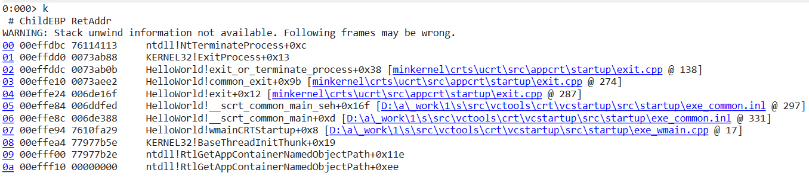

# Debugger Commands

**Table of Content**

* [**Help command**](#help-command)
* [**!analyze -v command**](#!analyze-v-command)
* [**Sympath command**](#sympath-command)
* [**Setting symbol path**](#setting-symbol-path)
* [**Debugger extensions**](#debugger-extensions)
* [**x command**](#x-command)
* [**ln command**](#ln-command)
* [**r command**](#r-command)
* [**k command**](#k-command)
* [**e command**](#e-command)
* [**u command**](#u-command)
* [**dc command**](#dc-command)
* [**dt command**](#dt-command)
* [**dv command**](#dv-command)
* [**'s' command**](#'s'-command)
* [**bp command**](#bp-command)
* [**t command**](#t-command)
* [**p command**](#p-command)
* [**gu command**](#gu-command)
* [**wt command**](#wt-command)
* [**.logopen command**](#t,p,.logopen-command)
* [**ChildEBP,retAddr,argstochild**](#childebp,retaddr,argstochild)
* [**Address Range**](#address-range)
* [**pipe command**](#pipe-command)
* [**version,vertarget commands**](#version,vertarget-commands)

## **Help command**

The Help command has the information about other commands.

we can launch help content in two ways.

**1. By clicking on help button.**

* Launch windbg application and select Local help button ,opens the Debugging Tools for Windows documentation.


* If you specify Text, the debugger opens the Index panel in the documentation and searches for Text as a keyword in the index.


**2. By .hh command**

* To use `.hh` command , Attach an notepad process to the debug(to attach notepad launch the notepad first).

* Click on File -> Attach to process -> notepad.exe -> attach 


* use `.hh` command to open the Debugging Tools for Windows documentation.

```markdown
.hh
```


* If you specify Text, the debugger opens the Index panel in the documentation and searches for Text as a keyword in the index.


## **!analyze -v command**

The `!analyze -v` command in WinDbg is a powerful automated debugging command that performs an analysis of the current state of the program being debugged, typically after an exception or crash.

```markdown
!analyze -v
```

Here's a breakdown of the command:

* **!analyze**: This is the basic automated analysis command. It performs an initial analysis of the state of the program.
* **-v**: This is an option that stands for "verbose". When you use -v with !analyze, the command provides more detailed output.

In the context of crash dump analysis, !analyze -v is often the first command you'd run after loading the crash dump.


**1. The first thing you see is a statistics of the debugging session**


**2. Global flag, a debugging flag which is associated with the user**


**3. Some of the debugging related information comes here**


**4. Exception record gives you information about the exception which has occurred**


**5. Thread ID of the faulting thread and exception code**


**6. Call stack gives you the picture of how the code path reached the exception point**


## **Sympath command**

The sympath command in WinDbg is used to display or set the symbol file path for the debugger. The symbol path tells the debugger where to find the symbol files (.pdb files) that correspond to the executable files (.exe, .dll files) that you are debugging.

1. **`.sympath` -> To display the current symbol path**

```markdown
.sympath
```


2. **.sympath, say "C:/temp" , it will set the symbol path to "C:/temp".**

* `.sympath "C:/temp"`

```markdown
.sympath "C:/temp"
```


3. **again check symbol path it will be set to c:/temp**


## **Setting symbol path**

* Open a execuatble file, file -> launch executable -> select the .exe file -> open.


* `lm` command -> loaded modules, if we check the module has a pdb symbol and the symbol is present in this particular path.


* take a copy **.pdb** file and save it for further reference

* next we will **delete .pdb file** from the project and **delete the cache** from the mentioned module path. i.e., **C:\ProgramData\Dbg\sym\HelloWorld.pdb\09F43444E582442E929DEDF81F87033D6\HelloWorld.pdb**

* now check the modules the symbol folder will not be loaded.


* To load the symbol file,create new folder in project named cssym(custom symbol path).


* paste the .pdb file in cssym folder ,which was copied before.


* copy the file path were .pdb file is pasted and load the sympath and use lm command to check symbols are loaded.

```markdown
.sympath srv*;D:\StudentRequest_ForDren\WindbgIntro\HelloWorld\cssym
```


## **Debugger extensions**

Debugger extensions in WinDbg are powerful tools that can extend the basic capabilities of the debugger. They provide additional commands and utilities for specific debugging tasks.

**.chain command**

* The `.chain` command in WinDbg displays the list of all loaded debugger extensions. When you issue this command, WinDbg will show you a list of all debugger extensions that have been loaded into the current debugging session, including their load addresses and versions.

```markdown
.chain
```


**.load command**

* To load an extension in WinDbg, you can use the .load command, followed by the path to the extension DLL. For example, to load the SOS extension.

```markdown
.load C:\Windows\Microsoft.NET\Framework\v4.0.30319\SOS.dll
```

* check the extension file loaded using `.chain` command.


**.unload command**

The .unload command in WinDbg is used to unload a debugger extension DLL.

```markdown
.unload C:\Windows\Microsoft.NET\Framework\v4.0.30319\SOS.dl
```


## **x command**

* The x command is used to display symbols that match a specific pattern. 

* It has the following syntax:

```markdown
x [Options] Module!Symbol
```

```markdown
x HelloWorld!*main*
```


## **ln command**

* The ln command is used to display the symbol nearest to a given address. It is typically used to determine what code or data is at a particular address. 

* It has the following syntax:

```markdown
ln [Address]
```


## **r command**

* The r command in WinDbg is used to display or modify the contents of registers. 

* It has the following syntax:

```markdown
r [Register [= [Expression]]]
```

**The command can be used in several ways:**

**1. Display all registers:**

* If you use the `r` command without any arguments, it displays the contents of all registers.

* This command will show the contents of all the registers for the current thread, including general-purpose registers, segment registers, flags, instruction pointer, and more.

```markdown
r
```


**2. Display a specific register**: 

* You can use the r command followed by a register name to display the contents of a specific register. For example, to view the contents of the eax register.

```markdown
r eax
```


**3. Modify a register:** 

* You can also use the r command to modify the contents of a register. To do this, you provide the register name followed by the new value. For example, to set the eax register to 0.

```markdown
r eax = 0
```


The `~*r` command in WinDbg displays the register context for all threads in the system.

```markdown
~*r
```

## **k command**

* The k command in WinDbg displays a stack trace of the current thread. It shows the sequence of function calls that the thread has made up to the point where it currently is.

```markdown
k
```



* The `.frame` command in WinDbg is used to set or display the current local context to a specific frame number.

```markdown
.frame <frame-number> ;dv
```


* `kvn` this command will show you the arguments to the child as well.

```markdown
kvn
```


* `kf` this command will show you the memory offset size for each frame.

```markdown
kf
```


* `~*k` command in WinDbg displays a stack trace for all threads in the system.

```markdown
~*k
```

## **e command**

The `e` command in WinDbg is used to enter values into memory at a specified location. It has the following syntax:

```markdown
e[d|q|p|a|u|f] [Address] [List]
```

-> e is the basic command for entering values into memory. By itself, e enters 4-byte hexadecimal values.

-> The optional character after e specifies the format of the data to enter:

* d enters 4-byte decimal integers.
* q enters 8-byte hexadecimal integers.
* p enters a pointer value.
* a enters an ASCII string.
* u enters a Unicode (UTF-16) string.
* f enters floating-point values.

-> Address is the memory location where you want to start entering data.

-> List is the data you want to enter, separated by spaces. The data should be in the format specified by the character after e.

**Example:**

* setting breakpoint in mytest function

```markdown
bp helloworld!MyTestFunc
```

* use `g` command to continue and it breaks at the breakpoint and step into the printf line.


* use `k` command to view the particular stack frame.


* click frame number 00 you can see there the string is helloworld.


* now i'm changing hello string to jack using `e` command

```markdown
ea 0x008eee58 "jack"
```

* and use the previous command to check it is edited.


## **u command** 

The u command in WinDbg is used to disassemble and display a range of memory as CPU instructions (i.e., assembly code). This command is typically used to inspect the instructions that a program will execute.

 

**ub command:**

The ub command in WinDbg is used to disassemble and display a range of memory as CPU instructions in reverse order. The command stands for "unassemble backward".


**uf command**

The uf command in WinDbg is used to disassemble and display a complete function in assembly language. This command stands for "unassemble function".


## **dc command**

The **dc command** in WinDbg is used to display memory in a formatted view. The dc command stands for "Display Memory as Double Words with ASCII characters". Double words are 4 bytes long, so each line of the output shows a sequence of double words, and also their ASCII interpretations.

```markdown
dc <Address>
```


**dps command**

The dps command in WinDbg is used to display memory, interpret data as both symbols and hexadecimal values, and display the resulting ASCII strings. The dps command stands for "Display Pointer-sized values with Symbols".


## **dt command**


The dt command in WinDbg is used to display type information, which includes the structure of data types and the values of variables or data structures. This command is especially useful for inspecting complex data types like structures, unions, classes, and so on.


## **dv command**


The dv command in WinDbg is used to display local variables and their values for the current function in the call stack.


## **'s' command**

The s command in WinDbg is used to search memory in a range of addresses for a pattern.

The command has the following syntax

```markdown
s [-[w|d|q|a|u|f]] Range Pattern
```

* -w specifies 2-byte word values.
* -d specifies 4-byte double word values.
* -q specifies 8-byte quad-word values.
* -a specifies ASCII string.
* -u specifies Unicode (UTF-16) string.
* -f specifies floating-point number.

Range specifies the range of memory to search, and Pattern is the data you are looking for.

Example:

```markdown
s -a 0 L?7fffffff "hello"
```


## **bp command**

The bp command in WinDbg is used to set a breakpoint at a specified location. Breakpoints are a common debugging tool that allow you to pause the execution of a program at a specific point, so you can inspect the state of the program at that point.

```markdown
bp [options] [Address [Passes] [CommandString]]
```

* options are optional parameters that control how the breakpoint behaves.
* Address is the memory address where you want to set the breakpoint. This can also be a function name or a source line, if you have symbol and source information.
* Passes is the number of times the breakpoint should be ignored before it triggers. This is optional.
* CommandString is a command or sequence of commands that WinDbg should execute when the breakpoint triggers.

```markdown
bp helloworld!MyTestFunc
```


## **t command**

The t command in WinDbg is used to execute a single instruction and then pause, also known as "step into". This allows you to follow the execution of a program line by line, and it will also follow execution into called functions.

```markdown
t
```


## **p command**

The p command in WinDbg is used to "step over" a function or instruction. This means it will execute a single line or instruction in your code, but if that instruction is a function call, it will execute the entire function and then pause, rather than stepping into the function.

```markdown
p
```


## **gu command**

The gu command in WinDbg stands for "Go Up", which executes until the current function is complete and returns,also known as "step out".

```markdown
gu
```


## **wt command**

The wt command in WinDbg stands for "Watch and Trace". This command executes the specified function, or the function at the current instruction pointer if no function is specified, and then provides a summary of the function's execution.

```markdown
wt
```


## **.logopen command**

The .logopen command in WinDbg is used to start logging all debugger input and output to a specified file.

**Syntax:**

```markdown
.logopen FileName
```

```markdown
.logopen D:\Windbg\op.txt
```

use .logclose command to close the file

```markdown
.logclose
```


## **ChildEBP,retAddr,argstochild**

While looking at call stack we will these three values i.e., **ChildEBP , retAddr and argstochild**.


**ChildEBP**

* ChildEBP is nothing but the saved ebp, with this we can get a lot of information,all the stack frame is accessed using the ebp, that is the ChildEBP.
* EBP is a register in the x86 architecture which stands for "Extended Base Pointer". This register is typically used to hold the base address of the current stack frame.
* When a function is called in a program, a new stack frame is created to hold the function's local variables and some other information. The EBP register is set to point to the base of this stack frame, which allows the function to correctly reference its local variables and arguments.

**retAddr**

* retAddr, short for "Return Address", typically refers to the memory address to which a function is supposed to return control after it finishes executing.
* When a function is called in a program, the address of the instruction immediately following the call is pushed onto the stack. This is the return address. After the function completes, it pops this address off the stack and jumps to it, thereby returning control to the point in the code where it was called.

**argstochild**

* argstochild typically refers to the arguments that are passed from a parent function to a child function in a function call.
* When a function is called in a program, the arguments to the function are typically pushed onto the stack, in reverse order (from last to first). These become the argstochild for the function being called (the child function).

## **Address Range**

The term "Address Range" generally refers to a contiguous block of addresses in memory, specified by a starting address and an ending address.

In the context of programming or debugging, an address range could be used to represent various things, such as:

* The range of addresses occupied by a function or a block of code.
* The range of addresses allocated for a buffer or an array.
* The range of addresses covered by a memory mapping.

**!teb** - this is a command to get the stack base and stack limit, so this is a property of the thread.

```markdown
!teb
```


we can check difference between stack base and stack limit

```markdown
?stackbase-stacklimit
```


I got 12288, this many bytes is the difference between these two addresses.

## **pipe command**

* pipe command will show you information about the debuggee.

```markdown
|
```


* this is the binary which is being debugged.

* double pipe command gives mode of debugging.

```markdown
||
```


## **version,vertarget commands**

The **version** command in WinDbg provides information about the version of the debugging tools being used, as well as the version of the target being debugged.

```markdown
version
```


The **vertarget** command in WinDbg provides information about the target system being debugged.

```markdown
vertarget
```

